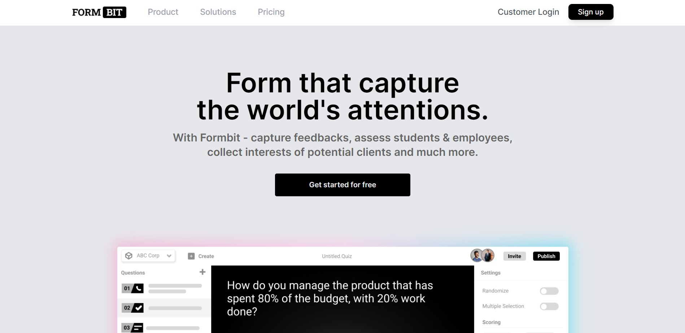

<p align="center">
  <a href="https://formbit.vercel.app/"></a>
</p>

<div align="center">
   <a href="https://formbit.vercel.app/"></a><br>
</div>

<p align="center">A complete website for SaaS Product</p>

<p align="center">
    <a href="https://formbit.vercel.app/"><b>Website</b></a> •
    <a href="https://github.com/torqbit/formbit"><b>Documentation</b></a>
</p>

<div align="center">

[](https://www.npmjs.org/package/axios)
[](https://gitter.im/mzabriskie/axios)
[](https://www.codetriage.com/axios/axios)
[](https://snyk.io/test/npm/axios)

</div>

## Browser Support

|  |  |  |  |  |  |
| ------------------------------------------------------------------------------------------------- | ---------------------------------------------------------------------------------------------------- | ------------------------------------------------------------------------------------------------- | ---------------------------------------------------------------------------------------------- | ------------------------------------------------------------------------------------------- | --------------------------------------------------------------------------------------------------------------------------------------- |
| Latest ✔                                                                                          | Latest ✔                                                                                             | Latest ✔                                                                                          | Latest ✔                                                                                       | Latest ✔                                                                                    | 11 ✔                                                                                                                                    |

[](https://saucelabs.com/u/axios)

### Features

Developer experience first, extremely flexible code structure and only keep what you need:

- ⚡ [Next.js](https://nextjs.org) with App Router support
- 🔥 Type checking [TypeScript](https://www.typescriptlang.org)
- 💎 Integrate with [Tailwind CSS](https://tailwindcss.com)
- ✅ Strict Mode for TypeScript and React 18
- ♻️ Type-safe environment variables with T3 Env
- 📏 Linter with [ESLint](https://eslint.org) (default NextJS, NextJS Core Web Vitals, Tailwind CSS)
- 💖 Code Formatter with [Prettier](https://prettier.io)
- 🦊 Husky for Git Hooks
- 🚫 Lint-staged for running linters on Git staged files
- 🚓 Lint git commit with Commitlint
- 📓 Write standard compliant commit messages with Commitizen
- 🦺 Unit Testing with Jest and React Testing Library
- 👷 Run tests on pull request with GitHub Actions
- 🤖 SEO metadata, JSON-LD and Open Graph tags
- 🗺️ Sitemap.xml and robots.txt with next-sitemap)
- 🌈 Include a FREE minimalist theme
- 💯 Maximize lighthouse score

Built-in feature from Next.js:

- ☕ Minify HTML & CSS
- 💨 Live reload
- ✅ Cache busting

### Philosophy

- Nothing is hidden from you, so you have the freedom to make the necessary adjustments to fit your needs and preferences.
- Easy to customize
- Minimal code
- SEO-friendly
- 🚀 Production-ready

### Requirements

- Node.js 20+ and npm or yarn

### Getting started

Run the following command on your local environment:

```shell
git clone https://github.com/torqbit/formbit.git
cd formbit
```

### Installing Packages

Using npm:

```bash
$ npm install
```

Using yarn:

```bash
$ yarn install
```

Then, you can run locally in development mode with live reload:

Using npm:

```bash
$ npm dev
```

Using yarn:

```bash
$ yarn dev
```

### Testing

All unit tests are located with the source code inside the same directory. So, it makes it easier to find them. The project uses Jest and React Testing Library for unit testing. You can run the tests with:

```shell
npm or yarn  run test
```

### Deploy to production

During the build process you can generate a production build with:

```shell
$ npm or yarn  run build
```

It generates an optimized production build. For testing the generated build, you can run:

```shell
$ npm or yarn run start
```

### VSCode information (optional)

If you are VSCode users, you can have a better integration with VSCode by installing the suggested extension in `.vscode/extension.json`. The starter code comes up with Settings for a seamless integration with VSCode. The Debug configuration is also provided for frontend and backend debugging experience.

With the plugins installed on your VSCode, ESLint and Prettier can automatically fix the code and show you the errors. Same goes for testing, you can install VSCode Jest extension to automatically run your tests and it also show the code coverage in context.

Pro tips: if you need a project wide type checking with TypeScript, you can run a build with <kbd>Cmd</kbd> + <kbd>Shift</kbd> + <kbd>B</kbd> on Mac.

### Contributions

Everyone is welcome to contribute to this project. Feel free to open an issue if you have question or found a bug. Totally open to any suggestions and improvements.

### License

Licensed under the MIT License, Copyright © 2024

See [LICENSE](LICENSE) for more information.
